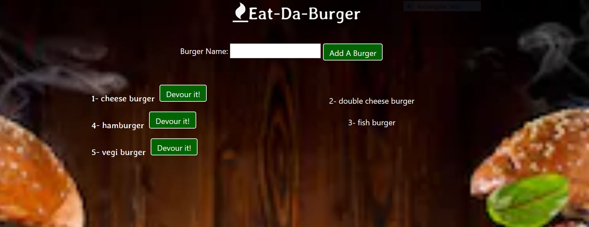

# burger

*   Git Repo
    https://github.com/yzhouyzhou/burger
 
*   heroku URL

*   The link was also added into my updated portfolio https://yzhouyzhou.github.io/Bootstrap-Portfolio/games.html
    burger July 30 2019

 

*   Overview
    This application is created with MySql, Node, Express, Handlebars and ORM. It follows the MVC design pattern; use Node and MySQL to query and route data and Handlebars to generate the HTML page.

